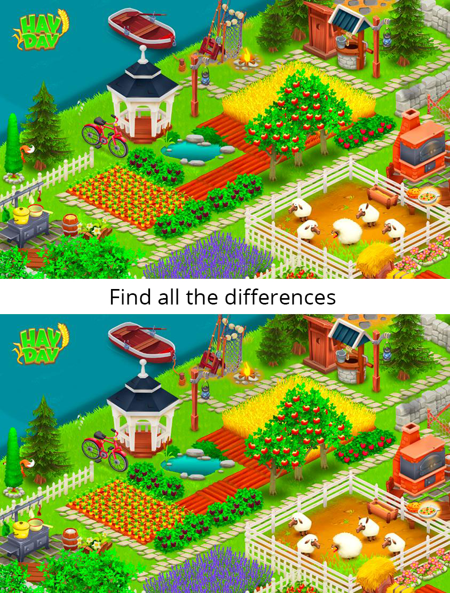
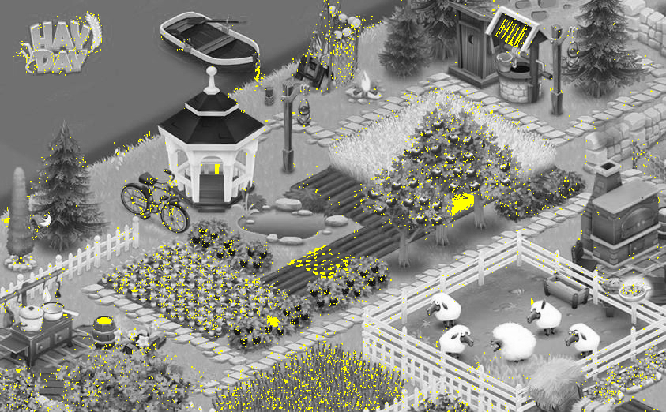

# Differ

## Summary
An algorithm written in Node, to spot the differences between two images. The algorithm uses percent differences in RGBA values between pixels of the two images and determines outliers by comparing values against a certain tolerance.

## Differences
* Liquid in the barrel
* Rope tied to the boat
* Fox's nose
* Roof of the well
* Vegetable
* Wheat
* Plowed soil
* Sheep's Ear
* Gazebo railing

## Thinking Process
When I first started the problem, I was able to spot several differences just by inspection, however I decided to write an algorithm to ensure I would spot all the differences. My first attempt at writing the algorithm involved comparing hexadecimal colour values of the pixels of both images, to my surprise, my program was outputting a 94% difference between the two images. Since the pixel colour comparison wasn't yielding any results, I opened the image in an editor and used an eye-dropper to find that the pixels which supposedly the "same" varied slightly while the pixels which were "different" varied quite a lot. So, I converted the hexadecimal colour into RGBA and calculated the percent difference between between the red aspect, green aspect, blue aspect, alpha aspect of each pixel. From there, I used the interquartile range to identify outliers.

## Time Spent
* Total of 4 hours
    * Choosing what language to use
    * Looking for a pixel manipulation library
    * Hexadecimal colour comparison approach
    * Calculating a percent tolerance to detect outliers
    * RGBA percent difference approach

## Dependencies
Jimp [[https://github.com/oliver-moran/jimp](https://github.com/oliver-moran/jimp)]

## Authors
Sufien Tout [[https://github.com/suft](https://github.com/suft)]
